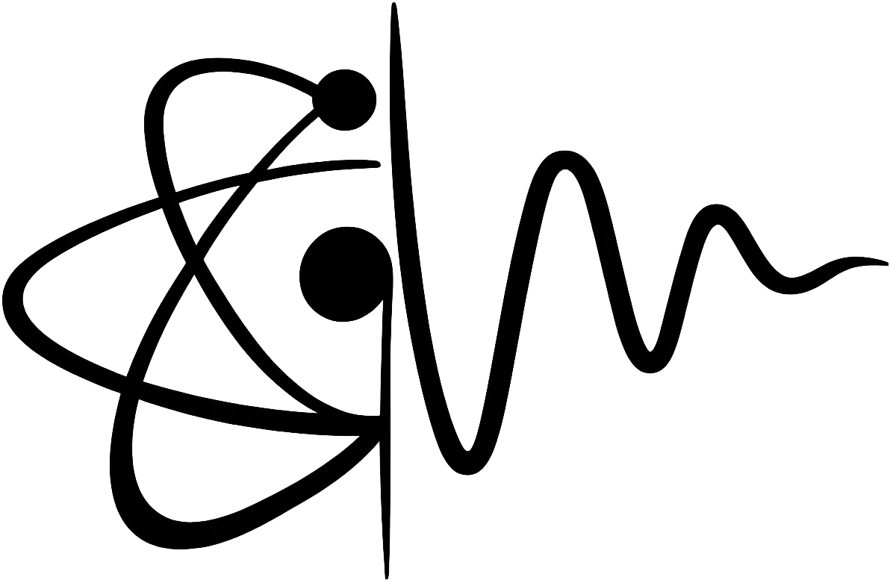

<p align="center">
  
</p>

<h1 align="center">DaveLabs</h1>
<p align="center"><strong>Intelligence & Physics Research</strong></p>

<p align="center">
  <em>Architecting Post-Classical Intelligence via Decentralized Cognitive Agent Networks</em>
</p>

---

## 🚀 About DaveLabs

DaveLabs is a cutting-edge research and technology company focused on building the future of autonomous intelligence systems. We specialize in developing advanced AI-powered solutions, blockchain intelligence, and digital infrastructure for businesses and individuals.

## 🧠 Our Products

### Oracle Seed
**Trade in Your Sleep** — Our flagship high-frequency autonomous intelligence platform for blockchain markets. Oracle Seed leverages our proprietary **DCAN (Decentralized Cognitive Agent Network)** architecture where intelligence emerges from collective agent behavior.

#### DCAN Core Architecture:
- **Agent Layer** — Autonomous Cognitive Units
- **Communication** — Quantum-Inspired Messaging
- **Consensus** — Emergent Decision Making
- **Action** — Coordinated Execution

#### Core Innovations:
- 🧊 **Belief State Manifolds** — Agent beliefs as embeddings
- ✨ **Emergent Consciousness** — High-level reasoning from dynamics
- 🔄 **Adaptive Topology** — Network structure evolves
- 📚 **Distributed Memory** — Knowledge distributed holographically
- ⚛️ **Causal Reasoning** — Building and testing causal models
- ⏱️ **Temporal Awareness** — Native understanding of time

### Amaka AI
Next-generation AI assistant technology.

### Garden
Innovative productivity and workflow solutions.

---

## 💼 Our Digital Services

| Service | Description |
|---------|-------------|
| **Digital Infrastructure** | Modern, scalable digital solutions for businesses |
| **AI Infrastructure** | Enterprise-grade AI systems and deployment |
| **Digital Marketing** | Data-driven marketing strategies and campaigns |
| **Video Production** | Professional video content creation |
| **Drone Shots** | Aerial cinematography and photography |
| **Team Training** | Comprehensive training programs for organizations |

---

## 🔬 Research

We are committed to pushing the boundaries of what's possible with AI and computing:

- 📄 **Published Papers** — Peer-reviewed research contributions
- 🔭 **Current Projects** — Active research initiatives
- 📐 **Methodology** — Novel approaches to problem-solving

---

## 👥 Our Teams

- **Research Team** — Pioneering new frontiers in AI and physics
- **Engineering** — Building robust, scalable systems
- **Creative** — Designing stunning visual experiences

---

## 🛠️ Tech Stack

This project is built with modern technologies:

- **Framework:** [Next.js 16](https://nextjs.org/) with React 19
- **Styling:** [Tailwind CSS](https://tailwindcss.com/) with custom animations
- **Animations:** [Framer Motion](https://www.framer.com/motion/)
- **3D Graphics:** [Three.js](https://threejs.org/) with React Three Fiber
- **Icons:** [Lucide React](https://lucide.dev/)

---

## 🚀 Getting Started

### Prerequisites

- Node.js 18+ 
- npm or yarn

### Installation

```bash
# Clone the repository
git clone https://github.com/davelabs/davelabs.git

# Navigate to the project
cd davelabs

# Install dependencies
npm install

# Start the development server
npm run dev
```

Open [http://localhost:3000](http://localhost:3000) to view the application.

### Build for Production

```bash
npm run build
npm start
```

---

## 📂 Project Structure

```
davelabs/
├── app/                    # Next.js App Router
│   ├── page.tsx           # Main landing page
│   ├── layout.tsx         # Root layout with metadata
│   └── globals.css        # Global styles
├── components/
│   ├── landing/           # Landing page sections
│   │   ├── OracleSeedSection1.tsx
│   │   ├── OracleSeedSection2.tsx
│   │   ├── OracleSeedSection3.tsx
│   │   └── DCANSection.tsx
│   └── ui/                # Reusable UI components
│       ├── CapsuleNav.tsx # Navigation component
│       ├── MetallicPaint.tsx
│       └── DarkVeil.tsx
├── public/                # Static assets
│   └── davelabslogo.png  # Company logo
└── package.json
```

---

## 💼 Careers

We're always looking for talented individuals to join our team:

- **Research Positions** — Push the boundaries of AI
- **Engineering Roles** — Build world-class systems
- **Creative & Filming** — Tell compelling stories

---

## 📞 Contact

- 🐦 **Twitter:** [@DaveLabs](https://twitter.com/DaveLabs)
- 💼 **LinkedIn:** [DaveLabs](https://linkedin.com/company/DaveLabs)
- 📧 **Email:** Contact us through our website

---

<p align="center">
  <strong>© 2024 DaveLabs. All rights reserved.</strong>
</p>

<p align="center">
  <em>Building the future of intelligence, one agent at a time.</em>
</p>
